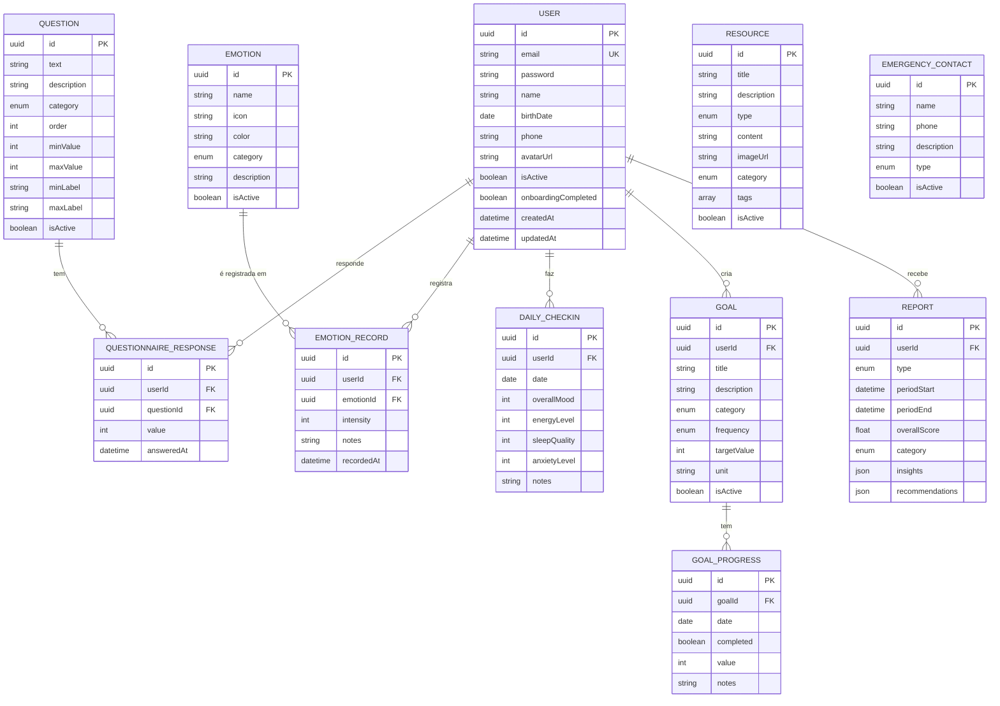

# Diagrama Entidade-Relacionamento (ER)

## Diagrama Mermaid

Cole o código abaixo no [Mermaid Live Editor](https://mermaid.live/) para visualizar:



## Diagrama Visual (ASCII)

```
┌─────────────────────────────────────────────────────────────────────────────┐
│                                                                              │
│   ┌──────────┐         ┌────────────────────┐         ┌──────────────┐      │
│   │ QUESTION │─────────│QUESTIONNAIRE_RESP. │─────────│     USER     │      │
│   └──────────┘   1:N   └────────────────────┘   N:1   └──────┬───────┘      │
│                                                               │              │
│                                                               │ 1:N          │
│   ┌──────────┐         ┌────────────────────┐               │              │
│   │ EMOTION  │─────────│  EMOTION_RECORD    │───────────────┤              │
│   └──────────┘   1:N   └────────────────────┘               │              │
│                                                               │              │
│                        ┌────────────────────┐               │              │
│                        │   DAILY_CHECKIN    │───────────────┤              │
│                        └────────────────────┘               │              │
│                                                               │              │
│   ┌──────────┐         ┌────────────────────┐               │              │
│   │GOAL_PROG.│─────────│       GOAL         │───────────────┤              │
│   └──────────┘   N:1   └────────────────────┘               │              │
│                                                               │              │
│                        ┌────────────────────┐               │              │
│                        │      REPORT        │───────────────┘              │
│                        └────────────────────┘                              │
│                                                                              │
│   ┌──────────────────┐         ┌────────────────────────┐                  │
│   │     RESOURCE     │         │   EMERGENCY_CONTACT    │                  │
│   │   (standalone)   │         │      (standalone)      │                  │
│   └──────────────────┘         └────────────────────────┘                  │
│                                                                              │
└─────────────────────────────────────────────────────────────────────────────┘
```

## Cardinalidade dos Relacionamentos

| Relacionamento | Cardinalidade | Descrição |
|----------------|---------------|-----------|
| User → QuestionnaireResponse | 1:N | Um usuário pode ter várias respostas |
| Question → QuestionnaireResponse | 1:N | Uma pergunta pode ter várias respostas |
| User → EmotionRecord | 1:N | Um usuário registra várias emoções |
| Emotion → EmotionRecord | 1:N | Uma emoção pode ser registrada várias vezes |
| User → DailyCheckIn | 1:N | Um usuário faz vários check-ins (1 por dia) |
| User → Goal | 1:N | Um usuário pode ter várias metas |
| Goal → GoalProgress | 1:N | Uma meta tem vários registros de progresso |
| User → Report | 1:N | Um usuário recebe vários relatórios |

## Constraints Importantes

- `User.email` - UNIQUE
- `DailyCheckIn(userId, date)` - UNIQUE (um check-in por dia por usuário)
- `GoalProgress(goalId, date)` - UNIQUE (um progresso por meta por dia)
- `QuestionnaireResponse(userId, questionId, answeredAt)` - UNIQUE
- Todos os FKs têm `ON DELETE CASCADE`
